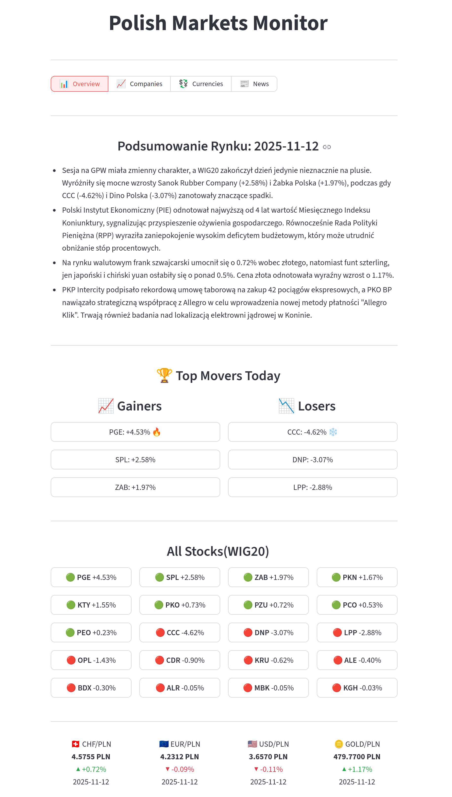
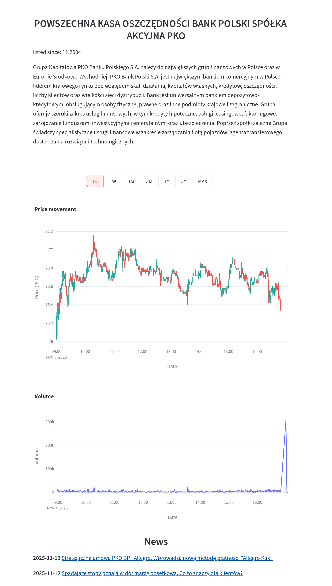

# Polish Markets Monitor

A fully containerized data platform for analyzing the Polish stock market (WIG20), aggregating company data, NBP currency rates, and financial news.

<div align="center">

[](https://markets.msdata.one)

**[View Live Demo →](https://markets.msdata.one)**

</div>
## 🚀 Key Features

* **GPW WIG20 Data:** OHLC stock data refreshed every 15 minutes on workdays.
* **NBP Data:** Daily currency exchange rates and gold prices.
* **News Aggregation:** Tracks financial news from Bankier.pl and Interia Biznes.
* **AI Summaries:** Daily, automated market summary generated by Google Gemini.
* **Interactive Dashboard:** Charts, date filters, and news browsing in one place.

## 🛠️ Tech Stack

* **Orchestration:** **Dagster** (for managing pipelines and schedules)
* **Data Processing:** **Polars** (for transformations) & **DuckDB** (for analytics)
* **Storage:** **MinIO (S3)** (for **Parquet** files with Hive partitioning)
* **Frontend:** **Streamlit**
* **Backend (API):** **FastAPI** (serving data to the dashboard)
* **Infrastructure:** **Docker** & **uv**

## 🏗️ Architecture & Data Flow

The architecture is fully decoupled into independent services that communicate via an API.

1.  **Data Sources** (NBP API, GPW website, RSS Feeds)
2.  ➔ **Dagster** (fetches and schedules jobs with retry policies)
3.  ➔ **Polars** (cleans and transforms data)
4.  ➔ **DuckDB** (writes data as Parquet to S3)
5.  ➔ **FastAPI** (serves data from S3 to the dashboard)
6.  ➔ **Streamlit** (loads and visualizes data)

## 🚀 Quick Start

The project is fully configured to run with a single command (requires an `.env` file with keys).

```bash
# Clone the repository
git clone [https://github.com/MaciejSzczepanski/polish_markets_monitor](https://github.com/MaciejSzczepanski/polish_markets_monitor)
cd polish-markets

# Build and run all services
docker compose up -d --build
```
**Note on Object Storage (S3/MinIO):**

This project requires an S3-compatible object storage for storing Parquet files. The `docker-compose.yml` does not include an S3 service by default.

For local development, **MinIO** is recommended. The application's data access layer is already configured to connect to MinIO when you set the `IS_MINIO=true` environment variable (along with `S3_ENDPOINT`, `S3_ACCESS_KEY_ID`, etc.).

## 📸 Screenshots

<details>
<summary>Dashboard Overview</summary>


</details>

<details>
<summary>Company Detail View</summary>


</details>


